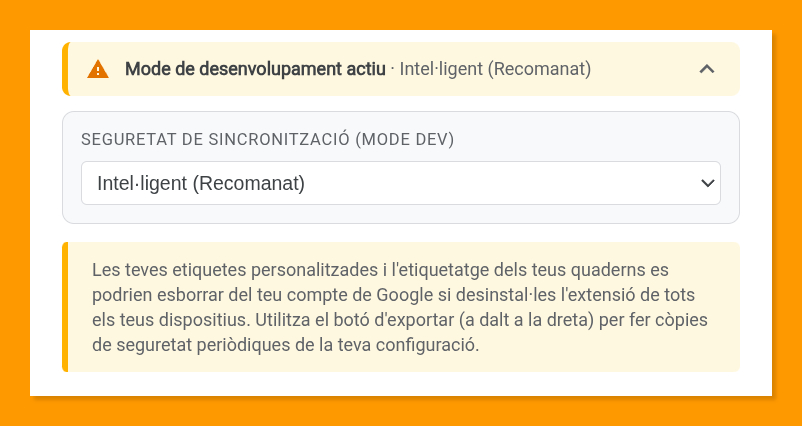

[🇪🇸 Versión en español](README.md) | [🇺🇸 English version](README.en.md)

# NotebookLM Organizer 🏷️

**NotebookLM Organizer** és una extensió de navegador dissenyada per potenciar l'organització del teu espai de treball a [Gemini Notebook](https://notebook.google.com) (anteriorment NotebookLM). Mitjançant un sistema d'etiquetes de colors i filtratge avançat, permet gestionar els teus quaderns amb una experiència d'usuari fluida i completament integrada, que se sent com una funcionalitat nativa de la plataforma.

---

## 🔒 Privadesa i seguretat

La privadesa és el pilar fonamental d'aquesta extensió. NotebookLM Organizer ha estat dissenyada sota el principi de **mínim accés necessari**:

- **Sense accés al contingut:** l'extensió **en cap moment** llegeix, accedeix ni processa el contingut del text, documents o fonts que guardes dins dels teus quaderns.
- **Només metadades organitzatives:** únicament llegeix el text visible de la targeta de cada quadern a la llista, com el **nom del quadern, el nombre de fonts i la data**. Aquestes dades s'utilitzen exclusivament per identificar el quadern, associar-li les teves etiquetes i permetre la cerca.
- **Sense manipulació de dades:** l'extensió no modifica ni manipula els teus quaderns de cap forma. Només afegeix una capa visual d'organització sobre la interfície existent de Google.
- **Les teves dades són teves:** tota la configuració s'emmagatzema al teu compte de Google (via Chrome Sync) i només tu hi tens accés.

---

## ✨ Característiques destacades

- 🏷️ **Etiquetatge amb colors:** crea etiquetes personalitzades amb una paleta de colors vibrants per categoritzar els teus projectes visualment.
- 🔍 **Filtratge avançat:** localitza quaderns a l'instant combinant cerca per text i filtres d'etiquetes amb lògica **I (AND)** o **O (OR)**.
- ✅ **Etiquetatge múltiple:** selecciona diversos quaderns (clic, Maj+clic o «Selecciona els visibles») i afegeix o treu etiquetes a tots alhora, amb opció de desfer.
- ⭐ **Etiquetes prioritàries:** marca amb una estrella les etiquetes que vols veure sempre primer a cada quadern.
- 📐 **Etiquetes ajustades a l'espai:** cada quadern mostra tantes etiquetes com hi caben i agrupa la resta en «+N», tant a la vista de quadrícula com a la de llista.
- 🎛️ **Tauler de gestió complet:** crea, canvia el nom, acoloreix i elimina etiquetes veient quants quaderns té cadascuna, amb filtre ràpid, contrast automàtic del text, mesurador de l'emmagatzematge sincronitzat i ús complet amb teclat.
- 🌓 **Mode fosc automàtic:** la interfície s'adapta automàticament al tema (clar o fosc) que tinguis configurat a Gemini Notebook, respectant la teva preferència visual al 100%.
- 🔄 **Sincronització automàtica:** les teves etiquetes i preferències es sincronitzen automàticament entre tots els teus dispositius mitjançant el teu compte de Chrome.
- 💾 **Respatller granular:** exporta i importa la teva configuració en format JSON, permetent triar quins elements restaurar.
- 🌐 **Suport multi-idioma:** interfície localitzada íntegrament en **espanyol, anglès i català**, amb canvi d'idioma instantani des de la interfície.
- 💡 **Gestió de destacats:** per neteja i conveniència, l'extensió oculta la vista prèvia limitada de quaderns destacats a la pestanya principal "Tots" i s'inhibeix automàticament a la pestanya de "Destacats".
- 🚀 **Accés ràpid:** fes clic a la icona de l'extensió des de qualsevol pàgina per obrir Gemini Notebook en una pestanya nova a l'instant.
- ⚡ **Interfície nativa:** dissenyada per oferir una experiència d'ús amb funcions ampliades que se sentin com natives de Gemini Notebook, sense trencar el teu flux de treball.

---

## 🧰 Organització avançada

### ✅ Etiquetatge múltiple
1. Prem **Selecciona** a la barra de l'extensió. Apareix una barra flotant a la part inferior.
2. Marca els quaderns: un **clic** en selecciona un, **Maj+clic** selecciona un interval i **Selecciona els visibles** hi afegeix tots els que mostren la cerca i els filtres actius.
3. Prem **Etiqueta**. Cada etiqueta indica si la tenen tots els quaderns seleccionats, alguns (amb el recompte) o cap: en prémer-la s'afegeix a tots o, si ja la tenen tots, es treu de tots. També pots crear una etiqueta nova i aplicar-la a la selecció.
4. Després de cada canvi apareix un avís amb **Desfés** durant uns segons. En tancar la finestra després d'algun canvi, el mode selecció s'acaba; si la tanques sense canvis, la selecció es conserva.

**Esc** tanca la finestra i, prement-la de nou, surt del mode selecció.

### ⭐ Etiquetes prioritàries
Al tauler de gestió, l'**estrella** de cada etiqueta la marca com a prioritària: a tots els quaderns es mostrarà abans que les altres, de manera que serà l'última a quedar amagada darrere de «+N». Entre diverses prioritàries, i també entre la resta, es respecta l'**ordre en què es van assignar a cada quadern**.

### 📐 Etiquetes visibles a cada quadern
Cada quadern mostra tantes etiquetes com hi caben i agrupa la resta en **«+N»**; en prémer-lo es veuen totes. En passar el punter per una etiqueta només apareix la vista amb totes si n'hi ha alguna d'amagada o si el seu nom està retallat. A la quadrícula, les etiquetes ocupen l'última línia de la targeta, alineades amb la icona de quadern compartit.

---

## 🔎 Com identifica l'extensió cada quadern

### El problema de partida
Per associar etiquetes a un quadern, l'extensió necessita un identificador estable. A la vista de quadrícula, Gemini Notebook inclou l'**identificador únic real** de cada quadern, però quan es va crear l'extensió la **vista de llista no l'exposava**. Davant d'aquesta limitació es va dissenyar un mecanisme alternatiu: una **petjada** calculada a partir de les metadades visibles de cada quadern.

### La petjada: com funciona i els seus límits
La petjada s'obté del **nom del quadern i el seu nombre de fonts**. Del nom s'ignoren majúscules, accents, espais i signes de puntuació, i només compten els **primers 30 caràcters** resultants; la data no hi intervé. És un compromís: amb més dades la petjada distingiria millor els quaderns, però també canviaria amb més freqüència.

Té dues limitacions:
- **Col·lisions:** dos quaderns diferents poden compartir petjada, per exemple «Unitat didàctica de Matemàtiques – Tema 1» i «Unitat didàctica de Matemàtiques – Tema 2» si tenen el mateix nombre de fonts. Com que l'extensió no pot saber quin és quin, **en bloqueja l'etiquetatge i la selecció** i mostra un avís (⚠️) per no assignar etiquetes al quadern equivocat.
- **Inestabilitat:** si canvia el nom del quadern o el seu nombre de fonts, també canvia la petjada.

Per compensar-ho, l'extensió memoritza la correspondència **petjada → identificador real** cada vegada que veu un quadern amb el seu identificador (per exemple, a la quadrícula), de manera que a la vista de llista pot recuperar l'identificador a partir de la petjada. I si una etiqueta s'arriba a assignar només amb la petjada, es desa provisionalment amb ella i es trasllada a l'identificador real tan bon punt aquest apareix.

### Què ha canviat
Actualment Gemini Notebook **sí que inclou l'enllaç a cada quadern, amb el seu identificador real, també a la vista de llista**. L'extensió el busca en aquest ordre: l'identificador del botó de la targeta, l'enllaç al quadern i qualsevol identificador present al seu codi. Només si no n'hi ha cap de disponible recorre a la taula de correspondències i, en darrer terme, a la petjada.

A la pràctica, **avui tots els quaderns s'identifiquen pel seu identificador real a totes dues vistes** i la petjada queda com a **mecanisme de reserva** per si Google torna a retirar aquest enllaç. Les col·lisions només es podrien donar en aquest cas.

### Efecte en l'emmagatzematge sincronitzat
La taula de correspondències creixia amb cada quadern vist, no es depurava mai i es sincronitzava amb Chrome Sync, l'espai del qual és molt limitat (uns 100 KB per extensió). Des de la versió 1.2:
- **ja no es sincronitza:** es desa només a l'equip local, que disposa de molt més espai;
- **només conserva els quaderns amb etiquetes**, els únics per als quals resulta útil;
- en actualitzar, la còpia antiga desapareix del núvol en el desament següent. En una prova amb 800 correspondències, l'espai sincronitzat va passar d'uns 54 KB a 0,5 KB.

No sincronitzar-la no té inconvenients pràctics: la taula es reconstrueix sola en navegar, de manera que en un altre equip es torna a aprendre tan bon punt es veuen els quaderns.

---

## ⚙️ Detalls tècnics

*   **Sense frameworks ni dependències externes:** desenvolupada íntegrament amb **Vanilla JS** i **CSS estàndard** per garantir la màxima lleugeresa, velocitat i compatibilitat.
*   **Manifest V3:** l'extensió utilitza l'última versió del manifest de Chrome per garantir la màxima seguretat i rendiment.
*   **Chrome Storage Sync & Local:** utilitza l'API d'emmagatzematge per mantenir les etiquetes sincronitzades entre dispositius i realitzar cachè local de seguretat.
*   **Dynamic i18n:** implementa un sistema de localització propi que permet el canvi d'idioma instantani sense necessitat de recarregar la pàgina.
*   **MutationObserver:** s'utilitza per detectar de forma eficient i reactiva quan s'afegeixen nous quaderns a la llista o es produeixen canvis en la navegació.
*   **Fragmentació de dades (chunking):** sistema per superar el límit de 8 KB per element de Chrome Sync dividint les dades en fragments mesurats en bytes reals. Els fragments nous s'escriuen abans d'esborrar els sobrants, de manera que un error d'escriptura mai no deixa el núvol buit. El tauler de gestió mostra l'espai utilitzat (Chrome permet uns 100 KB per extensió), l'extensió avisa en arribar al 80 % i, si una escriptura falla, ho indica a la pantalla. La taula que relaciona petjades i identificadors ja no ocupa espai sincronitzat (consulta «Com identifica l'extensió cada quadern»).
*   **Rendiment:** les lectures i escriptures del DOM s'agrupen i els quaderns s'analitzen en una sola passada, cosa que manté la interfície fluida fins i tot amb centenars de quaderns.
*   **ID d'extensió predefinit:** el `manifest.json` inclou una clau pública (`key`) per assegurar que l'ID de l'extensió sigui idèntic en totes les instal·lacions manuals. Això és indispensable perquè Chrome Sync reconegui que es tracta de la mateixa extensió i permeti la sincronització. **Important:** tot i que l'ID sigui el mateix per a tots els usuaris d'aquest repositori, les teves dades estan vinculades exclusivament al teu compte de Google i ningú més pot accedir-hi.
*   **Permisos:**
    *   `storage`: per guardar i sincronitzar les teves etiquetes i preferències.
    *   `activeTab`: només en fer clic a la icona de l'extensió, per comprovar si la pestanya actual ja és Gemini Notebook i, si no ho és, obrir-lo en una pestanya nova.

---

## 💾 Gestió de dades i seguretat avançada

NotebookLM Organizer integra un motor de sincronització adaptatiu que detecta automàticament l'entorn d'instal·lació per garantir la màxima seguretat de la teva organització.

Atès que Google Chrome pot eliminar les dades de sincronització en desinstal·lar una extensió carregada manualment (Mode Dev), s'ha implementat un sistema de **redundància dual** i un **assistent de resolució de conflictes**.

### 🛠️ Modes de seguretat en desenvolupament (instal·lació manual)
Mentre l'extensió s'utilitzi en mode de desenvolupament, disposaràs de tres nivells de protecció configurables des de la secció **Avançat** (desplegable) del modal de gestió d'etiquetes:

  

1.  **Intel·ligent (recomanat):** utilitza una **heurística de confiança**. Si detecta una pèrdua massiva de dades al núvol (tenint almenys 3 etiquetes en local i detectant-ne menys de la meitat al núvol), el sistema activa l'assistent de recuperació.
2.  **Validació manual:** el mode més estricte. Sempre que hi hagi una discrepància en les mètriques entre aquest equip i el núvol, l'extensió et demanarà confirmar quina versió vols mantenir.
3.  **Només núvol:** desactiva la redundància local i es comporta de forma minimalista, confiant exclusivament en Google Sync (comportament idèntic a la versió de la botiga).

### 🔄 Assistent de recuperació
Quan es detecta una inconsistència, l'extensió mostra un diàleg detallat amb mètriques comparatives perquè prenguis una decisió informada:

  

---

## 🧠 Filosofia de disseny: independència i resiliència

Durant el desenvolupament d'aquesta extensió, es va plantejar una decisió de disseny crítica: com evitar que Google esborri les dades de sincronització en desinstal·lar la versió de desenvolupament?

Una solució ràpida hauria estat registrar l'extensió a la Chrome Web Store per obtenir un **ID oficial**. En utilitzar aquest identificador en la versió de desenvolupament, les dades al núvol quedarien "ancorades" a la versió de la botiga, de manera que el navegador deixaria d'eliminar-les automàticament en desinstal·lar una instància local. No obstant això, es va optar per **no fer-ho** per prioritzar els següents principis:

1.  **Sobirania i codi obert:** en no dependre d'un ID assignat per una botiga propietària, el projecte és 100% independent i portable. Qualsevol persona pot clonar el repositori i tenir un sistema funcional i segur sense passar pel control d'una plataforma externa.
2.  **Arquitectura de resiliència:** en lloc de confiar en una política de base de datos de tercers (que pot canviar), s'ha construït una infraestructura de seguretat pròpia. L'extensió és ara un sistema autònom capaç d'autoreparar-se.
3.  **Transparència:** aquest camí va obligar a crear l'**assistent de conflictes**, la qual cosa dona a l'usuari un control total i una visibilitat absoluta sobre la seva informació, quelcom que el sistema "invisible" de Google no proporciona.

En resum: s'ha triat el camí del **maestratge tècnic** sobre el camí curt, garantint que NotebookLM Organizer sigui una eina tan robusta com independent.

---

## 🏪 Funcionament en mode oficial (Chrome Web Store)

Si l'extensió s'instal·la des de la botiga oficial, detecta l'entorn i simplifica la seva lògica al màxim. En aquest mode, confia plenament en la infraestructura nativa de Google Sync i opera de forma lleugera sense necessitat de mantenir backups locals redundants ni mostrar diàlegs de conflicte.

**Important:** en desinstal·lar l'extensió oficial, Google elimina automàticament totes les dades sincronitzades associades al teu compte per a aquesta extensió. Si vols conservar la teva organització per a una instal·lació futura, realitza sempre una exportació manual abans d'eliminar-la.

---

## ⚠️ Recomanacions de seguretat

-   **Exportació manual (botó d'exportar del modal de gestió):** independentment del mode d'instal·lació, es recomana realitzar còpies de seguretat periòdiques descarregant la configuració en format JSON. És la xarxa de seguretat definitiva per si tota la resta falla. *Shit happens* 😅.
-   **Conserva sempre un "guardià" (només mode dev):** mentre mantinguis l'extensió instal·lada en almenys un dispositiu, les teves dades es podran recuperar automàticament en els altres gràcies a la redundància local.
-   **Actualitzacions (només mode dev):** per instal·lar una nova versió del codi, no cal desinstal·lar l'extensió. Simplement sobreescriu els fitxers a la teva carpeta local i prem el botó de recàrrega a `chrome://extensions`.

---

## 🛠️ Instal·lació

La forma més senzilla i recomanada d'instal·lar l'extensió és a través de la **Chrome Web Store**:

👉 [**Instal·la des de la Chrome Web Store**](https://chromewebstore.google.com/detail/bolafachcnffchfenddbfpbfcfhgahen?utm_source=item-share-cb)

### Instal·lació manual (mode desenvolupador)
Si prefereixes instal·lar-la manualment per fer proves o contribuir al codi, segueix aquests passos:

1. Descarrega i descomprimeix l'arxiu zip o clona aquest repositori al teu equip.
2. Obre Google Chrome i ves a la pàgina d'extensions: `chrome://extensions`.
3. Activa el **"Mode de desenvolupador"** a la part superior dreta.
4. Fes clic en el botó **"Carrega descomprimida"**.
5. Selecciona la carpeta **extension** dins de la carpeta del projecte que has descarregat o clonat.
6. Fet! L'extensió apareixerà al teu llistat d'extensions i estarà activa a `notebook.google.com` (i `notebooklm.google.com`).

---

## 📝 Nota sobre el manteniment

Aquesta extensió està disponible de forma oficial a la **Chrome Web Store**. No obstant això, atès que el seu funcionament es basa en l'anàlisi de l'estructura del DOM de l'aplicació Gemini Notebook (NotebookLM), i aquesta pot canviar en qualsevol moment sense previ avís, l'autor adverteix que el manteniment davant canvis estructurals de Google es realitzarà de forma voluntària. El cost de manteniment i la necessitat d'adaptar-la a canvis freqüents fan que sigui un projecte impulsat per la comunitat i el codi obert.

> **Important per a desenvolupadors:** Si vols publicar la teva pròpia versió a la Store, s'ha inclòs l'arxiu **`extension/manifest.webstore.json`**. Aquest arxiu és una versió "neta" que **no inclou la propietat `key`** (obligatòria per obtenir un ID oficial nou). Per fer-lo servir, simplement canvia el nom de `manifest.webstore.json` a `manifest.json` just abans d'empaquetar la carpeta `extension` per a la seva pujada a la consola de desenvolupadors.

---

## 🤝 Crèdits

Aquest projecte ha estat creat i és mantingut per **Pablo Felip** ([LinkedIn](https://www.linkedin.com/in/pfelipm/) | [GitHub](https://github.com/pfelipm)).

---

## 📄 Llicència

Aquest projecte es distribueix sota els termes de l'arxiu [LICENSE](LICENSE).
