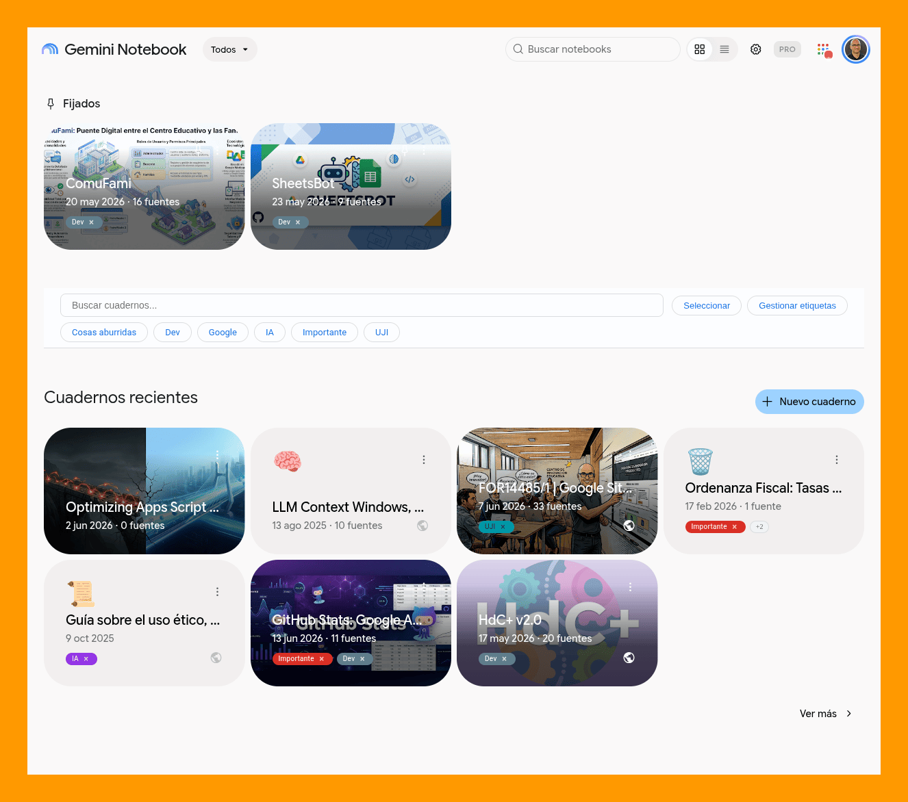
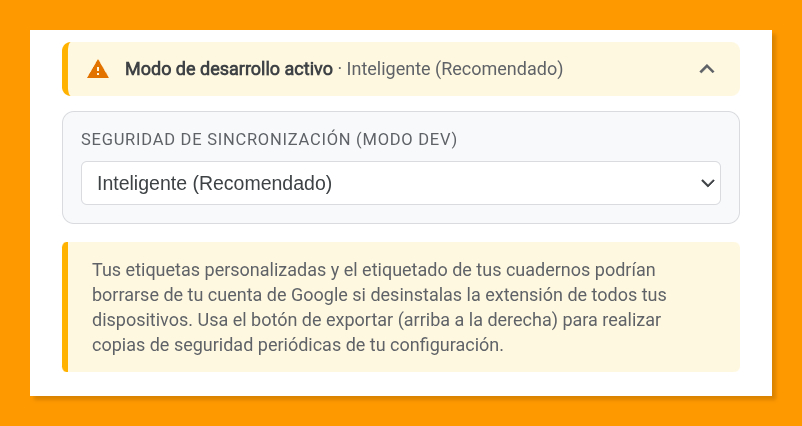

[🇺🇸 English version](README.en.md) | [🦎 Versió en català](README.ca.md)

# NotebookLM Organizer 🏷️

**NotebookLM Organizer** es una extensión de navegador diseñada para potenciar la organización de tu espacio de trabajo en [Gemini Notebook](https://notebook.google.com) (anteriormente NotebookLM). Mediante un sistema de etiquetas de colores y filtrado avanzado, permite gestionar tus cuadernos con una experiencia de usuario fluida y completamente integrada, que se siente como una funcionalidad nativa de la plataforma.

---

## 🔒 Privacidad y seguridad

La privacidad es el pilar fundamental de esta extensión. NotebookLM Organizer ha sido diseñada bajo el principio de **mínimo acceso necesario**:

- **Sin acceso al contenido:** la extensión **en ningún momento** lee, accede ni procesa el contenido del texto, documentos o fuentes que guardas dentro de tus cuadernos.
- **Solo metadatos organizativos:** únicamente lee el texto visible de la tarjeta de cada cuaderno en la lista, como el **nombre del cuaderno, el número de fuentes y la fecha**. Estos datos se utilizan exclusivamente para identificar el cuaderno, asociarle tus etiquetas y permitir la búsqueda.
- **Sin manipulación de datos:** la extensión no modifica ni manipula tus cuadernos de ninguna forma. Solo añade una capa visual de organización sobre la interfaz existente de Google.
- **Tus datos son tuyos:** toda la configuración se almacena en tu cuenta de Google (vía Chrome Sync) y solo tú tienes acceso a ella.

---

## ✨ Características destacadas

- 🏷️ **Etiquetado con colores:** crea etiquetas personalizadas con una paleta de colores vibrantes para categorizar tus proyectos visualmente.
- 🔍 **Filtrado avanzado:** localiza cuadernos al instante combinando búsqueda por texto y filtros de etiquetas con lógica **Y (AND)** u **O (OR)**.
- ✅ **Etiquetado múltiple:** selecciona varios cuadernos (clic, Mayús+clic o «Seleccionar visibles») y aplica o quita etiquetas a todos de una vez, con opción de deshacer.
- ⭐ **Etiquetas prioritarias:** marca con una estrella las etiquetas que quieres ver siempre primero en cada cuaderno.
- 📐 **Etiquetas ajustadas al espacio:** cada cuaderno muestra tantas etiquetas como caben, agrupando el resto en «+N», tanto en la vista de cuadrícula como en la de lista.
- 🎛️ **Panel de gestión completo:** crea, renombra, colorea y elimina etiquetas viendo cuántos cuadernos tiene cada una, con filtro rápido, contraste automático del texto y uso completo con teclado.
- 🌓 **Modo oscuro automático:** la interfaz se adapta automáticamente al tema (claro u oscuro) que tengas configurado en Gemini Notebook, respetando tu preferencia visual al 100%.
- 🔄 **Sincronización automática:** tus etiquetas y preferencias se sincronizan automáticamente entre todos tus dispositivos mediante tu cuenta de Chrome.
- 💾 **Respaldo granular:** exporta e importa tu configuración en formato JSON, permitiendo elegir qué elementos restaurar.
- 🌐 **Soporte multi-idioma:** interfaz localizada íntegramente en **español, inglés y català**, con cambio de idioma instantáneo desde la interfaz.
- 💡 **Gestión de destacados:** por limpieza y conveniencia, la extensión oculta la vista previa limitada de cuadernos destacados en la pestaña principal "Todos" y se inhibe automáticamente en la pestaña de "Destacados".
- 🚀 **Acceso rápido:** haz clic en el icono de la extensión desde cualquier página para abrir Gemini Notebook en una nueva pestaña al instante.
- ⚡ **Interfaz nativa:** diseñada para ofrecer una experiencia de uso con funciones ampliadas que se sientan como nativas de Gemini Notebook, sin romper tu flujo de trabajo.

---

## 🧰 Organización avanzada

### ✅ Etiquetado múltiple
1. Pulsa **Seleccionar** en la barra de la extensión. Aparece una barra flotante en la parte inferior.
2. Marca los cuadernos: un **clic** selecciona uno, **Mayús+clic** selecciona un rango y **Seleccionar visibles** añade todos los que muestran la búsqueda y los filtros activos.
3. Pulsa **Etiquetar**. Cada etiqueta indica si la tienen todos los cuadernos seleccionados, algunos (con su recuento) o ninguno: al pulsarla se añade a todos o, si ya la tienen todos, se quita de todos. También puedes crear una etiqueta nueva y aplicarla a la selección.
4. Tras cada cambio aparece un aviso con **Deshacer** durante unos segundos. Al cerrar la ventana después de algún cambio, el modo selección termina; si la cierras sin cambios, la selección se conserva.

**Esc** cierra la ventana y, pulsado de nuevo, sale del modo selección.

### ⭐ Etiquetas prioritarias
En el panel de gestión, la **estrella** de cada etiqueta la marca como prioritaria: en todos los cuadernos se mostrará antes que las demás, así será la última en quedar oculta tras «+N». Entre varias prioritarias, y también entre el resto, se respeta el **orden en que se asignaron a cada cuaderno**.

### 📐 Etiquetas visibles en cada cuaderno
Cada cuaderno muestra tantas etiquetas como caben en su espacio y agrupa el resto en **«+N»**; al pulsarlo se ven todas. Al pasar el puntero por una etiqueta solo aparece la vista con todas si hay alguna oculta o si su nombre está recortado. En la cuadrícula, las etiquetas ocupan la última línea de la tarjeta, alineadas con el icono de cuaderno compartido.

---

## ⚠️ Nota importante sobre la vista de lista

Debido a que Gemini Notebook no expone identificadores únicos internos en todas sus vistas, la extensión utiliza una "huella digital" basada en metadatos para identificar cada cuaderno. 

Esta huella se obtiene a partir del **nombre del cuaderno y su número de fuentes**. Del nombre se ignoran mayúsculas, tildes, espacios y signos de puntuación, y solo se tienen en cuenta los **primeros 30 caracteres** resultantes. Por ello, dos cuadernos pueden compartir huella aunque sus nombres no sean idénticos, por ejemplo «Unidad didáctica de Matemáticas – Tema 1» y «Unidad didáctica de Matemáticas – Tema 2» si ambos tienen el mismo número de fuentes.

Si tienes varios cuadernos con la **misma huella**, la extensión detectará una **colisión** en la vista de lista y bloqueará el etiquetado por seguridad para evitar errores de asociación. En estos casos, aparecerá un icono de aviso (⚠️) y deberás utilizar la **vista de miniaturas** (cuadrícula) para etiquetarlos, ya que en esa vista sí es posible obtener un identificador único real. Por el mismo motivo, estos cuadernos tampoco se pueden seleccionar en el modo de etiquetado múltiple desde la vista de lista.

---

## ⚙️ Detalles técnicos

*   **Sin frameworks ni dependencias externas:** desarrollada íntegramente con **Vanilla JS** y **CSS estándar** para garantizar la máxima ligereza, velocidad y compatibilidad.
*   **Manifest V3:** la extensión utiliza la última versión del manifiesto de Chrome para garantizar la máxima seguridad y rendimiento.
*   **Chrome Storage Sync & Local:** utiliza la API de almacenamiento para mantener las etiquetas sincronizadas entre dispositivos y realizar caché local de seguridad.
*   **Dynamic i18n:** implementa un sistema de localización propio que permite el cambio de idioma instantáneo sin necesidad de recargar la página.
*   **MutationObserver:** se utiliza para detectar de forma eficiente y reactiva cuándo se añaden nuevos cuadernos a la lista o se producen cambios en la navegación.
*   **Fragmentación de datos (chunking):** sistema para superar el límite de 8 KB por elemento de Chrome Sync dividiendo los datos en fragmentos medidos en bytes reales. Los fragmentos nuevos se escriben antes de borrar los sobrantes, de modo que un fallo de escritura nunca deja la nube vacía.
*   **Rendimiento:** las lecturas y escrituras del DOM se agrupan y los cuadernos se analizan en una sola pasada, lo que mantiene la interfaz fluida incluso con cientos de cuadernos.
*   **ID de extensión predefinido:** el `manifest.json` incluye una clave pública (`key`) para asegurar que el ID de la extensión sea idéntico en todas tus instalaciones manuales. Esto es indispensable para que Chrome Sync reconozca que se trata de la misma extensión y permita la sincronización. **Importante:** aunque el ID sea el mismo para todos los usuarios de este repositorio, tus datos están vinculados exclusivamente a tu cuenta de Google y nadie más puede acceder a ellos.
*   **Permisos:**
    *   `storage`: para guardar y sincronizar tus etiquetas y preferencias.
    *   `activeTab`: solo al pulsar el icono de la extensión, para comprobar si la pestaña actual ya es Gemini Notebook y, si no lo es, abrirlo en una pestaña nueva.

---

## 💾 Gestión de datos y seguridad avanzada

NotebookLM Organizer integra un motor de sincronización adaptativo que detecta automáticamente el entorno de instalación para garantizar la máxima seguridad de tu organización. 

Debido a que Google Chrome puede eliminar los datos de sincronización al desinstalar una extensión cargada manualmente (Modo Dev), se ha implementado un sistema de **redundancia dual** y un **asistente de resolución de conflictos**.

### 🛠️ Modos de seguridad en desarrollo (instalación manual)
Mientras la extensión se use en modo de desarrollo, dispondrás de tres niveles de protección configurables desde la sección **Avanzado** (desplegable) del modal de gestión de etiquetas:

  

1.  **Inteligente (recomendado):** utiliza una **heurística de confianza**. Si detecta una pérdida masiva de datos en la nube (teniendo al menos 3 etiquetas en local y detectando menos de la mitad en la nube), el sistema activa el asistente de recuperación.
2.  **Validación manual:** el modo más estricto. Siempre que haya una discrepancia en las métricas entre este equipo y la nube, la extensión te pedirá confirmar qué versión deseas mantener.
3.  **Solo nube:** desactiva la redundancia local y se comporta de forma minimalista, confiando exclusivamente en Google Sync (comportamiento idéntico a la versión de la tienda).

### 🔄 Asistente de recuperación
Cuando se detecta una inconsistencia, la extensión muestra un diálogo detallado con métricas comparativas para que tomes una decisión informada:

  

---

## 🧠 Filosofía de diseño: independencia y resiliencia

Durante el desarrollo de esta extensión, se planteó una decisión de diseño crítica: ¿cómo evitar que Google borre los datos de sincronización al desinstalar la versión de desarrollo?

Una solución rápida hubiera sido registrar la extensión en la Chrome Web Store para obtener un **ID oficial**. Al usar este identificador en la versión de desarrollo, los datos en la nube quedarían "anclados" a la versión de la tienda, de modo que el navegador dejaría de eliminarlos automáticamente al desinstalalar una instancia local. Sin embargo, se optó por **no hacerlo** para priorizar los siguientes principios:

1.  **Soberanía y código abierto:** al no depender de un ID asignado por una tienda propietaria, el proyecto es 100% independiente y portable. Cualquier persona puede clonar el repositorio y tener un sistema funcional y seguro sin pasar por el control de una plataforma externa.
2.  **Arquitectura de resiliencia:** en lugar de confiar en una política de base de datos de terceros (que puede cambiar), se ha construido una infraestructura de seguridad propia. La extensión es ahora un sistema autónomo capaz de autorrepararse.
3.  **Transparencia:** este camino obligó a crear el **asistente de conflictos**, lo que da al usuario un control total y una visibilidad absoluta sobre su información, algo que el sistema "invisible" de Google no proporciona.

En resumen: se ha elegido el camino de la **maestría técnica** sobre el camino corto, garantizando que NotebookLM Organizer sea una herramienta tan robusta como independiente.

---

## 🏪 Funcionamiento en modo oficial (Chrome Web Store)

Si la extensión se instala desde la tienda oficial, detecta el entorno y simplifica su lógica al máximo. En este modo, confia plenamente en la infraestructura nativa de Google Sync y opera de forma ligera sin necesidad de mantener backups locales redundantes ni mostrar diálogos de conflicto.

**Importante:** al desinstalar la extensión oficial, Google elimina automáticamente todos los datos sincronizados asociados a tu cuenta para esta extensión. Si deseas conservar tu organización para una instalación futura, realiza siempre una exportación manual antes de eliminarla.

---

## ⚠️ Recomendaciones de seguridad

-   **Exportación manual (botón de exportar del modal de gestión):** independientemente del modo de instalación, se recomienda realizar copias de seguridad periódicas descargando la configuración en formato JSON. Es la red de seguridad definitiva por si todo lo demás falla. *Shit happens* 😅.
-   **Conserva siempre un "guardián" (solo modo dev):** mientras mantengas la extensión instalada en al menos un dispositivo, tus datos podrán recuperarse automáticamente en los demás gracias a la redundancia local.
-   **Actualizaciones (solo modo dev):** para instalar una nueva versión del código, no es necesario desinstalar la extensión. Simplemente sobreescribe los archivos en tu carpeta local y pulsa el botón de recarga en `chrome://extensions`.

---

## 🛠️ Instalación

La forma más sencilla y recomendada de instalar la extensión es a través de la **Chrome Web Store**:

👉 [**Instalar desde la Chrome Web Store**](https://chromewebstore.google.com/detail/bolafachcnffchfenddbfpbfcfhgahen?utm_source=item-share-cb)

### Instalación manual (modo desarrollador)
Si prefieres instalarla manualmente para realizar pruebas o contribuir al código, sigue estos pasos:

1. Descarga y descomprime el archivo zip o clona este repositorio en tu equipo.
2. Abre Google Chrome y dirígete a la página de extensiones: `chrome://extensions`.
3. Activa el **"Modo de desarrollador"** en la parte superior derecha.
4. Haz clic en el botón **"Cargar descomprimida"**.
5. Selecciona la carpeta **extension** dentro de la carpeta del proyecto que has descargado o clonado.
6. ¡Listo! La extensión aparecerá en tu listado de extensiones y estará activa en `notebook.google.com` (y `notebooklm.google.com`).

---

## 📝 Nota sobre el mantenimiento

Esta extensión está disponible de forma oficial en la **Chrome Web Store**. No obstante, dado que su funcionamiento se basa en el análisis de la estructura del DOM de la aplicación Gemini Notebook (NotebookLM), y esta puede cambiar en cualquier momento sin previo aviso, el autor advierte que el mantenimiento ante cambios estructurales de Google se realizará de forma voluntaria. El coste de mantenimiento y la necesidad de adaptarla a cambios frecuentes hacen que sea un proyecto impulsado por la comunidad y el código abierto.

> **Importante para desarrolladores:** Si deseas publicar tu propia versión en la Store, se ha incluido el archivo **`extension/manifest.webstore.json`**. Este archivo es una versión "limpia" que **no incluye la propiedad `key`** (obligatoria para obtener un ID oficial nuevo). Para usarlo, simplemente renombra `manifest.webstore.json` a `manifest.json` justo antes de empaquetar la carpeta `extension` para su subida a la consola de desarrolladores.

---

## 🤝 Créditos

Este proyecto ha sido creado y es mantenido por **Pablo Felip** ([LinkedIn](https://www.linkedin.com/in/pfelipm/) | [GitHub](https://github.com/pfelipm)).

---

## 📄 Licencia

Este proyecto se distribuye bajo los términos del archivo [LICENSE](LICENSE).
